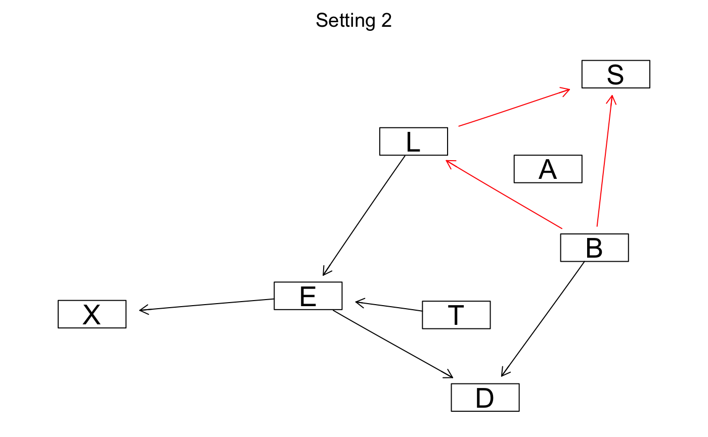
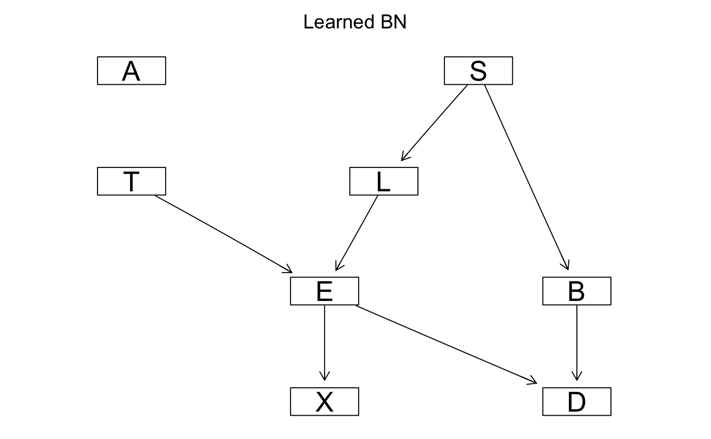

```{r setup, include=FALSE}
knitr::opts_chunk$set(echo = TRUE)
library(bnlearn)
library(gRain)
```

## Contributions 

**We disscussed and solved all questions together, Yifan mainly contribute to Q1.1, Chao mainly contribute to Q1.2,
Yunan mainly contribute to Q1.3, and Ravinder mainly contributed to Q1.4. We disscussed and wrote Q1.5 together.**

## Q1.1

**1.Default setting**
```{r}
data("asia")
dag1 <-hc(asia)
```


**2.Consider a different start structure with $B \longrightarrow L \longrightarrow S$ rather than empty DAG:**

```{r}
init <- model2network("[A][T][B][L|B][S|L][E][X][D]")
dag2 <-hc(asia, start=init)
```

**3. $L \longrightarrow S \longrightarrow B:$**

```{r}
init <- model2network("[A][T][B|S][S|L][L][E][X][D]")
dag3 <-hc(asia, start=init)
```

**4.AIC Score**

```{r}
dag4 <-hc(asia, score='aic')
```

```{r, include = FALSE}
graphviz.compare(dag1, dag2, dag3, dag4, shape = "rectangle", layout = "fdp",
  main = c("Setting 1", "Setting 2", "Setting 3", "Setting 4"))
```

{#id .class width=50% height=50%} {#id .class width=50% height=50%}

{#id .class width=50% height=50%} {#id .class width=50% height=50%}

**Show that multiple runs of the hill-climbing algorithm can return non-equivalent Bayesian network (BN) structures. Explain why this happens.**
  
  **Answer:** All above 4 graphs are the same except the edges among $B,S,L$. With different setting of HC, We have:
  
* 1. $L \longleftarrow S \longrightarrow B$ (Default setting)
* 2. Sheilded collider $B \longrightarrow L \longrightarrow S$ with $B \longrightarrow S$ (Initial structure $B \longrightarrow L \longrightarrow S$)
* 3. $L \longrightarrow S \longrightarrow B$ (Initial structure $L \longrightarrow S \longrightarrow B$)
* 4. Then got a graph quite unreasonable (Using AIC score)

In case 1,3, they are equivalent with different direction of edges, but case 2 has one more edge than 1,3, case 4 generate a graph with even more edges and quite unreasonable. Therefore under some different setting HC generated non-equivalent structures, this might because HC algorithm randomly add, remove and reverse edges, thus sometimes stacks in local optima if we do not have a good start point.

## Q1.2

{#id .class width=50% height=50%} {#id .class width=50% height=50%}

```{r q2-0 }
#asia<-apply(asia, 2, as.character)

#train and test split
n <- dim(asia)[1]
set.seed(1010)
id <- sample(1:n, floor(n*0.8))
train <- asia[id,]

id1 <- setdiff(1:n, id)
set.seed(1010)
#id2 <- sample(id1, floor(n*0.2))
test <- asia[id1,]

```


```{r q2-1 }
# Create structure
structure <- hc(train)
fit <- bn.fit(x = structure, data = train)  # training data , structure learning
fit_grain <- as.grain(fit)
```

```{r q2-2}

compiled_grain <- compile(fit_grain)  # necessary syntax to use needed proporties

# Manipulating data, for the function querygrain needs the data to be in character form
test2 <- test
test <- apply(test, 2, as.character)

# nodes to S: "A", "T", "L", "B", "E", "X", "D"
nodes_2_S<-colnames(asia)[-2]

```

```{r q2-3-0}

compiled_obj = compiled_grain
nodes_from = nodes_2_S  # nodes towards s
node_to = "S"  # objective variable
new_data = test[, -2]  # data
  
# my prediction function
my_pred<-function(compiled_obj,nodes_from, node_to,new_data){
  
  predictions <- c()

  for (i in 1:nrow(new_data)){
    evidence <- setEvidence(object = compiled_obj,
                            nodes = nodes_from,  # node names
                            states = new_data[i,] )   # data
  
  posterior <- unlist(querygrain(object = evidence, nodes=node_to))
  
  if (posterior[1] > 0.5) {
    predictions[i] <- "No"} 
  else {
    predictions[i] <- "Yes"  }
  
  }
 
return(predictions)  
}

res=my_pred(compiled_obj,nodes_from, node_to,new_data)
confusion_matrix <- table(test2$S, res)
print('Confusion Matrix of Learned Graph')
confusion_matrix
sum(confusion_matrix[c(1,4)])/sum(confusion_matrix)
```

The True Graph

```{r q2-4}
# True Bayesian Network
true_dag <- model2network("[A][S][T|A][L|S][B|S][D|B:E][E|T:L][X|E]")
fit_true <- bn.fit(x = true_dag, data = train)%>%as.grain()
```


```{r q2-5}

# parameters involved

compiled_obj = compile(fit_true)  # true dag model
nodes_from = nodes_2_S
node_to = "S"
new_data = test[, -2]

res=my_pred(compiled_obj,nodes_from, node_to,new_data)
confusion_matrix <- table(test2$S, res)
print('Confusion matrix of True Graph')
confusion_matrix
sum(confusion_matrix[c(1,4)])/sum(confusion_matrix)
```


## Q1.3

```{r q3 }

markov_blanket <- mb(x = fit, node = "S")

# parameters involved
compiled_obj = compiled_grain  # markov obj
nodes_from = markov_blanket   # cliques toward S
node_to = "S"
new_data = test[, markov_blanket]

# predict
res=my_pred(compiled_obj,nodes_from, node_to,new_data)
# res
confusion_matrix <- table(test2$S, res)
confusion_matrix
sum(confusion_matrix[c(1,4)])/sum(confusion_matrix)
```


## Q1.4

{#id .class width=50% height=50%}

```{r q4-0}
# Naive Bayes:
naive_bayes = model2network("[S][A|S][T|S][L|S][B|S][E|S][X|S][D|S]")
# building  object
naive_bayes <- bn.fit(x = naive_bayes, data = train) %>%as.grain() %>%compile()


# parameters involved
compiled_obj = naive_bayes
nodes_from = nodes_2_S
node_to = "S"
new_data = test[, -2]

# predict
res=my_pred(compiled_obj,nodes_from, node_to,new_data)
# res
confusion_matrix <- table(test2$S, res)
confusion_matrix
sum(confusion_matrix[c(1,4)])/sum(confusion_matrix)

```


## Q1.5

We got the same results for Q1.2 Generated Graph and Q1.3 Markov Blanket, but different results for Q1.4 Naive Bayes. The explaination as follow:

First we consider the conditional distribution of S in This Asia Network:


$$P(S|B,L,E,D,X,T,A) = \frac{P(S)P(B|S)P(L|S)\textcolor{red}{P(D|B,E)P(E|T,L)P(T|A)P(A)}}{\sum_SP(S)P(B|S)P(L|S)\textcolor{red}{P(D|B,E)P(E|T,L)P(T|A)P(A)}}$$
$$~~~~~~~~~~~~~~~~~~~~~~~~=\frac{P(S)P(B|S)P(L|S)}{\sum_SP(S)P(B|S)P(L|S)}=\frac{P(S,B,L)}{P(B,L)}=P(S|B,L)$$

Note $P(S|B,L)$ is Markov blanket of $S$. Regardless the structure of $P(E,D,X,T,A|B,L)$, the partial structure $L\longleftarrow S \longrightarrow B$ is the same in Q1.2 and Q1.3. Above formula hold for all 3 situations, the confusion matrix thus should be the same.

But in Q1.4 the Naive Bayes model is:

$$P(S|B,L,E,D,X,T,A) = \frac{P(S)P(B,L,E,D,X,T,A|S)}{\sum_SP(S)P(B,L,E,D,X,T,A|S)}=\frac{P(S)P(B,L,E,D,X,T,A|S)}{P( B,L,E,D,X,T,A)}$$

in which variables cannot be further estimated. Then this returns a different result, also the accuracy is lower than previous Bayesian Network.


## Apendix

```{r, ref.label=knitr::all_labels(),echo=TRUE,eval=FALSE}
```
