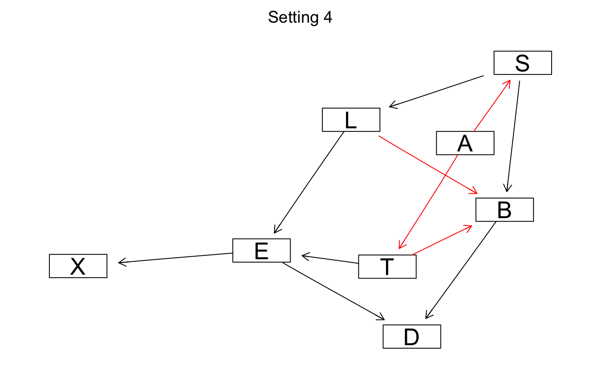

```{r setup, include=FALSE}
knitr::opts_chunk$set(echo = TRUE)

library(bnlearn)
```

## Q1.1

**1.Default setting**
```{r}
data("asia")
dag1 <-hc(asia)
```


**2.Consider a different start structure with $B \longrightarrow L \longrightarrow S$ rather than empty DAG:**

```{r}
init <- model2network("[A][T][B][L|B][S|L][E][X][D]")
dag2 <-hc(asia, start=init)
```

**3. $L \longrightarrow S \longrightarrow B:$**

```{r}
init <- model2network("[A][T][B|S][S|L][L][E][X][D]")
dag3 <-hc(asia, start=init)
```

**4.Different restart value**

```{r}
dag4 <-hc(asia, restart = 12)
```

```{r, include = FALSE}
graphviz.compare(dag1, dag2, dag3, dag4, shape = "rectangle", layout = "fdp",
  main = c("Setting 1", "Setting 2", "Setting 3", "Setting 4"))
```

{#id .class width=50% height=50%} {#id .class width=50% height=50%}

{#id .class width=50% height=50%} {#id .class width=50% height=50%}

**Show that multiple runs of the hill-climbing algorithm can return non-equivalent Bayesian network (BN) structures. Explain why this happens.**
  
  **Answer:** All above 4 graphs are the same except the edges among $B,S,L$. With different setting of HC, We have:
  
* 1. $L \longleftarrow S \longrightarrow B$ (Default setting)
* 2. Sheilded collider $B \longrightarrow L \longrightarrow S$ with $B \longrightarrow S$ (Initial structure $B \longrightarrow L \longrightarrow S$)
* 3. $L \longrightarrow S \longrightarrow B$ (Initial structure $L \longrightarrow S \longrightarrow B$)
* 4. $B \longleftarrow S \longleftarrow L$ (Different restart setting)

In case 1,3,4, they are equivalent but with different direction of edges, but case 2 has one more edge than others, thus generated a non-equivalent structures, this might because HC algorithm randomly add, remove and reverse edges, thus sometimes stacks in local optima if we do not have a good start point.

## Q1.2

```{r}
set.seed(1)

# separate data
data("asia")
sample_train <- as.integer(dim(asia)[1] * 0.8)
sample_test <- dim(asia)[1] - sample_train
index <- sample(1:dim(asia)[1])
train <- asia[index[1:sample_train],]
test <- asia[index[1:sample_test],]

dag_learn <- hc(train)
dag_true <- model2network("[A][S][T|A][L|S][B|S][D|B:E][E|T:L][X|E]")
#graphviz.compare(dag_learn, dag_true, shape = "rectangle", main = c("Learned BN", "Original BN"))

model_learn = bn.fit(dag_learn, data = train)
model_true = bn.fit(dag_true, data = train)


## prediction for generated structure
pred_learn <- c()
for (i in 1:dim(test)[1]) {

    logits <- prop.table(table(cpdist(model_learn, "S", ((A == unlist(test[i,]["A"]))&(T == unlist(test[i,]["T"])&(L == unlist(test[i,]["L"]))&(B == unlist(test[i,]["B"]))&(E == unlist(test[i,]["E"]))&(X == unlist(test[i,]["X"]))&(D == unlist(test[i,]["D"])))))))
    index <- which(is.na(logits))
    logits[index] = 0.5
    if (logits[1] > 0.5)
      pred_learn <- c(pred_learn, 'no')
    else
      pred_learn <- c(pred_learn, 'yes')  
}


pred_true <- c()
for (i in 1:dim(test)[1]) {

    logits <- prop.table(table(cpdist(model_true, "S", ((A == unlist(test[i,]["A"]))&(T == unlist(test[i,]["T"])&(L == unlist(test[i,]["L"]))&(B == unlist(test[i,]["B"]))&(E == unlist(test[i,]["E"]))&(X == unlist(test[i,]["X"]))&(D == unlist(test[i,]["D"])))))))
    index <- which(is.na(logits))
    logits[index] = 0.5
    if (logits[1] > 0.5)
      pred_true <- c(pred_true, 'no')
    else
      pred_true <- c(pred_true, 'yes')  
}

print(table(pred_learn, true=test$S))
print(table(pred_true, true=test$S))

```

{#id .class width=50% height=50%} {#id .class width=50% height=50%}

## Q1.3

```{r}
mb(dag_learn, "S")

## prediction for generated structure
pred_learn <- c()
for (i in 1:dim(test)[1]) {

    logits <- prop.table(table(cpdist(model_learn, "S", ((L == unlist(test[i,]["L"]))&(B == unlist(test[i,]["B"]))))))
    index <- which(is.na(logits))
    logits[index] = 0.5
    if (logits[1] > 0.5)
      pred_learn <- c(pred_learn, 'no')
    else
      pred_learn <- c(pred_learn, 'yes')  
}


mb(dag_true, "S")

pred_true <- c()
for (i in 1:dim(test)[1]) {

    logits <- prop.table(table(cpdist(model_true, "S",((L == unlist(test[i,]["L"]))&(B == unlist(test[i,]["B"]))))))
    index <- which(is.na(logits))
    logits[index] = 0.5
    if (logits[1] > 0.5)
      pred_true <- c(pred_true, 'no')
    else
      pred_true <- c(pred_true, 'yes')  
}

print(table(pred_learn, true=test$S))
print(table(pred_true, true=test$S))


```


## Q1.4

```{r}
dag_naive <- model2network("[S][A|S][T|S][L|S][B|S][D|S][E|S][X|S]")
#graphviz.plot(dag_naive, shape = "rectangle", main=c("Naive Bayes"))

model_naive = bn.fit(dag_naive, data = train)

pred_naive <- c()
for (i in 1:dim(test)[1]) {

    logits <- prop.table(table(cpdist(model_naive, "S", ((A == unlist(test[i,]["A"]))&(T == unlist(test[i,]["T"])&(L == unlist(test[i,]["L"]))&(B == unlist(test[i,]["B"]))&(E == unlist(test[i,]["E"]))&(X == unlist(test[i,]["X"]))&(D == unlist(test[i,]["D"])))))))
    index <- which(is.na(logits))
    logits[index] = 0.5
    if (logits[1] > 0.5)
      pred_naive <- c(pred_naive, 'no')
    else
      pred_naive <- c(pred_naive, 'yes')  
}

print(table(pred_naive, true=test$S))
```

{#id .class width=50% height=50%}

## Q1.5
