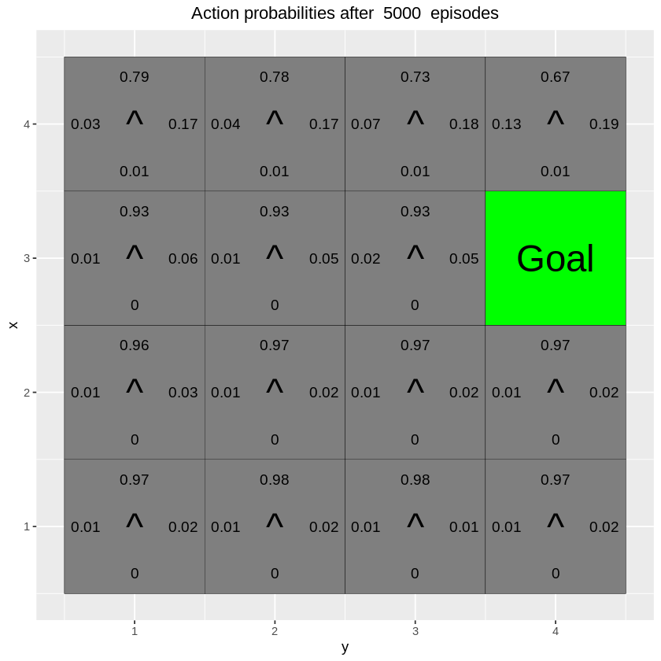

```{r setup, include=FALSE}
knitr::opts_chunk$set(echo = TRUE)
```

## Contributions 

**We solved all questions individually and discussed together, we wrote our comment together.**

## Environment A

**What has the agent learned after the first 10 episodes ?**

{#id .class width=50% height=50%}

**Answer:** As in figure 1, the agent learned a few transitions, such as when agent is above on 10, then move to 10 (positive q-value), or when agent close to -1s, agent would avoid to move to -1s (negative q-value).


**Is the final greedy policy (after 10000 episodes) optimal for all states, i.e. not only for the initial state ? Why / Why not ?**

{#id .class width=50% height=50%}

**Answer:** As in figure 2, it is not optima for all states. In state (1, 3), the best policy is go right and then up to the final state with reward 10. But the agent will choose to go left and then walk a long way to reach the final state. This is because the initial position of agent is (3,1), then the agent can only have a small possibility to walk to (1,3), and therefore the Q-table at state (1, 3) can not be well optimized. This can be found in figure 3 below, we get the best optima in (1, 3), but also create other sub-optima in the up-left corner.

{#id .class width=50% height=50%}

**Do the learned values in the Q-table reflect the fact that there are multiple paths (above and below the negative rewards) to get to the positive reward ? If not, what could be done to make it happen ?**

**Answer:** No, since the agent will choose the action with the largest value in Q-table, so there is only one path to go. The agent will slip to other position if we do not use a deterministic transition_model, that is, give beta a probability between (0, 1) instead of 0.


## Environment B

Moving average of reward with $\epsilon = 0.5, 0.1$ and $\gamma = 0.5, 0.75, 0.95$ respectively.

{#id .class width=30% height=30%} {#id .class width=30% height=30%} {#id .class width=30% height=30%} 


{#id .class width=30% height=30%} {#id .class width=30% height=30%} {#id .class width=30% height=30%} 

Moving average of correction with $\epsilon = 0.5, 0.1$ and $\gamma = 0.5, 0.75, 0.95$ respectively.

{#id .class width=30% height=30%} {#id .class width=30% height=30%} {#id .class width=30% height=30%} 

{#id .class width=30% height=30%} {#id .class width=30% height=30%} {#id .class width=30% height=30%} 

Q-Table with $\epsilon = 0.5, 0.1$ and $\gamma = 0.5, 0.75, 0.95$ respectively.

{#id .class width=30% height=30%} {#id .class width=30% height=30%} {#id .class width=30% height=30%} 


{#id .class width=30% height=30%} {#id .class width=30% height=30%} {#id .class width=30% height=30%} 


**Explain your observations.**

**Answer:** 

$\epsilon$ is the probability of acting greedily, therefore when $\epsilon$ is smaller the more possible the agent will randomly explore more rather than follow the temporal best policy (Q-Table), we can also see this from Q-table above, plots with smaller $\epsilon$ have more green area. Since the smaller $\epsilon$ explore more, therefore the moving average of reward is also smaller.

$\gamma$ is the discount factor, higher $\gamma$ means we hope the agent get more reward from future (long-term) instead of reward recent (short term), so as $\gamma$ increasing the agent prefer to move to 10 and leave a white block in the 5 position.

## Environment C

{#id .class width=50% height=50%} {#id .class width=50% height=50%} 

{#id .class width=50% height=50%} {#id .class width=50% height=50%} 
**Explain your observations.**

**Answer:** $\beta$ is the uncertainty factor of transition model, the probability of actual action given an action, $\beta = 0$ is a deterministic model, the actual action is the given action. With $\beta$ increasing, we can see the Q-table changes especially in the second row, from right arrows to up arrows. Because of the uncertainty, agent might move to -1 areas (slip right) thus get a negative reward. So agent choose a safety way to go (go up and right then go down to avoid to hit -1 areas).


## Environment D

**Has the agent learned a good policy? Why / Why not ?**

**Answer:** We think it is an ok policy, check the results after 5000 epoch training:


{#id .class width=50% height=50%} {#id .class width=50% height=50%} 
{#id .class width=50% height=50%} {#id .class width=50% height=50%} 
{#id .class width=50% height=50%} {#id .class width=50% height=50%} 
{#id .class width=50% height=50%} {#id .class width=50% height=50%} 

Since those goal actually not exist in training set, but still, the agent can find the goal with extra feature (here is just the position of the goal) in most time.

**Could you have used the Q-learning algorithm to solve this task ?**

**Answer:** In Q-learning, we only have the fixed Q-table, once we changed the position of goal, we need to train a new table, so it is not possible to do it.

## Environment E

{#id .class width=30% height=30%} {#id .class width=30% height=30%} {#id .class width=30% height=30%} 

**Has the agent learned a good policy? Why / Why not ?**

**Answer** Not at all, the agent can not find the final goal in most time. This is because the training sets are only on the top row, but validation sets are on the rest position. There is a huge domain gap between training set and validation set, which means two datasets are not overlapped, or I can say they from two totally different distribution. This model heavily overfitted on training set therefore can not generalize to validation set.

**If the results obtained for environments D and E differ, explain why.**

**Answer:** In D, training set and validation set are "overlapped", or I can say the interpolation is possible. But in E, the extrapolation is not possible, it is not only impossible for Deep-Q, it is impossible for any machine learning algorithm. Or as mentioned above, the model totally overfitted in E.


## Apendix

```{r, ref.label=knitr::all_labels(),echo=TRUE,eval=FALSE}

# By Jose M. Peña and Joel Oskarsson.
# For teaching purposes.
# jose.m.pena@liu.se.

#####################################################################################################
# Q-learning
#####################################################################################################

# install.packages("ggplot2")
# install.packages("vctrs")
library(ggplot2)

arrows <- c("^", ">", "v", "<")
action_deltas <- list(c(1,0), # up
                      c(0,1), # right
                      c(-1,0), # down
                      c(0,-1)) # left

vis_environment <- function(iterations=0, epsilon = 0.5, alpha = 0.1, gamma = 0.95, beta = 0){
  
  # Visualize an environment with rewards. 
  # Q-values for all actions are displayed on the edges of each tile.
  # The (greedy) policy for each state is also displayed.
  # 
  # Args:
  #   iterations, epsilon, alpha, gamma, beta (optional): for the figure title.
  #   reward_map (global variable): a HxW array containing the reward given at each state.
  #   q_table (global variable): a HxWx4 array containing Q-values for each state-action pair.
  #   H, W (global variables): environment dimensions.
  
  df <- expand.grid(x=1:H,y=1:W)
  foo <- mapply(function(x,y) ifelse(reward_map[x,y] == 0,q_table[x,y,1],NA),df$x,df$y)
  df$val1 <- as.vector(round(foo, 2))
  foo <- mapply(function(x,y) ifelse(reward_map[x,y] == 0,q_table[x,y,2],NA),df$x,df$y)
  df$val2 <- as.vector(round(foo, 2))
  foo <- mapply(function(x,y) ifelse(reward_map[x,y] == 0,q_table[x,y,3],NA),df$x,df$y)
  df$val3 <- as.vector(round(foo, 2))
  foo <- mapply(function(x,y) ifelse(reward_map[x,y] == 0,q_table[x,y,4],NA),df$x,df$y)
  df$val4 <- as.vector(round(foo, 2))
  foo <- mapply(function(x,y) 
    ifelse(reward_map[x,y] == 0,arrows[GreedyPolicy(x,y)],reward_map[x,y]),df$x,df$y)
  df$val5 <- as.vector(foo)
  foo <- mapply(function(x,y) ifelse(reward_map[x,y] == 0,max(q_table[x,y,]),
                                     ifelse(reward_map[x,y]<0,NA,reward_map[x,y])),df$x,df$y)
  df$val6 <- as.vector(foo)
  
  print(ggplot(df,aes(x = y,y = x)) +
          scale_fill_gradient(low = "white", high = "green", na.value = "red", name = "") +
          geom_tile(aes(fill=val6)) +
          geom_text(aes(label = val1),size = 4,nudge_y = .35,na.rm = TRUE) +
          geom_text(aes(label = val2),size = 4,nudge_x = .35,na.rm = TRUE) +
          geom_text(aes(label = val3),size = 4,nudge_y = -.35,na.rm = TRUE) +
          geom_text(aes(label = val4),size = 4,nudge_x = -.35,na.rm = TRUE) +
          geom_text(aes(label = val5),size = 10) +
          geom_tile(fill = 'transparent', colour = 'black') + 
          ggtitle(paste("Q-table after ",iterations," iterations\n",
                        "(epsilon = ",epsilon,", alpha = ",alpha,"gamma = ",gamma,", beta = ",beta,")")) +
          theme(plot.title = element_text(hjust = 0.5)) +
          scale_x_continuous(breaks = c(1:W),labels = c(1:W)) +
          scale_y_continuous(breaks = c(1:H),labels = c(1:H)))
  
}

GreedyPolicy <- function(x, y){
  
  # Get a greedy action for state (x,y) from q_table.
  #
  # Args:
  #   x, y: state coordinates.
  #   q_table (global variable): a HxWx4 array containing Q-values for each state-action pair.
  # 
  # Returns:
  #   An action, i.e. integer in {1,2,3,4}.
  
  # Your code here.
  action <- which.max(q_table[x, y,])
  return(action)
}

EpsilonGreedyPolicy <- function(x, y, epsilon){
  
  # Get an epsilon-greedy action for state (x,y) from q_table.
  #
  # Args:
  #   x, y: state coordinates.
  #   epsilon: probability of acting randomly.
  # 
  # Returns:
  #   An action, i.e. integer in {1,2,3,4}.
  
  # Your code here.
  seed <- rbinom(1, 1, epsilon)
  if (seed == 1) {
    action <- which.max(q_table[x, y,])
  }else{
    action = sample(c(1,2,3,4), 1)
  }
  return(action)
}

transition_model <- function(x, y, action, beta){
  
  # Computes the new state after given action is taken. The agent will follow the action 
  # with probability (1-beta) and slip to the right or left with probability beta/2 each.
  # 
  # Args:
  #   x, y: state coordinates.
  #   action: which action the agent takes (in {1,2,3,4}).
  #   beta: probability of the agent slipping to the side when trying to move.
  #   H, W (global variables): environment dimensions.
  # 
  # Returns:
  #   The new state after the action has been taken.
  
  delta <- sample(-1:1, size = 1, prob = c(0.5*beta,1-beta,0.5*beta))
  final_action <- ((action + delta + 3) %% 4) + 1
  foo <- c(x,y) + unlist(action_deltas[final_action])
  foo <- pmax(c(1,1),pmin(foo,c(H,W)))
  
  return (foo)
}

q_learning <- function(start_state, epsilon = 0.5, alpha = 0.1, gamma = 0.95, 
                       beta = 0){
  
  # Perform one episode of Q-learning. The agent should move around in the 
  # environment using the given transition model and update the Q-table.
  # The episode ends when the agent reaches a terminal state.
  # 
  # Args:
  #   start_state: array with two entries, describing the starting position of the agent.
  #   epsilon (optional): probability of acting greedily.
  #   alpha (optional): learning rate.
  #   gamma (optional): discount factor.
  #   beta (optional): slipping factor.
  #   reward_map (global variable): a HxW array containing the reward given at each state.
  #   q_table (global variable): a HxWx4 array containing Q-values for each state-action pair.
  # 
  # Returns:
  #   reward: reward received in the episode.
  #   correction: sum of the temporal difference correction terms over the episode.
  #   q_table (global variable): Recall that R passes arguments by value. So, q_table being
  #   a global variable can be modified with the superassigment operator <<-.
  
  # Your code here.
  
  repeat{
    # Follow policy, execute action, get reward.
    x <- start_state[1]
    y <- start_state[2]
    action <- EpsilonGreedyPolicy(x, y, epsilon)
    start_state <- transition_model(x, y, action, beta)
    new_x <- start_state[1]
    new_y <- start_state[2]
    # Q-table update.
    reward <- reward_map[new_x, new_y]
    episode_correction <-  reward + gamma * max(q_table[new_x, new_y, ]) - q_table[x, y, action]
    q_table[x, y, action] <<- q_table[x, y, action] + alpha * episode_correction
    if(reward!=0)
      # End episode.
      return (c(reward,episode_correction))
  }
  
}

#####################################################################################################
# Q-Learning Environments
#####################################################################################################

# Environment A (learning)

H <- 5
W <- 7

reward_map <- matrix(0, nrow = H, ncol = W)
reward_map[3,6] <- 10
reward_map[2:4,3] <- -1

q_table <- array(0,dim = c(H,W,4))

vis_environment()

for(i in 1:10000){
  foo <- q_learning(start_state = c(3,1))
  
  if(any(i==c(10,100,1000,10000)))
    vis_environment(i)
}

# Environment B (the effect of epsilon and gamma)

H <- 7
W <- 8

reward_map <- matrix(0, nrow = H, ncol = W)
reward_map[1,] <- -1
reward_map[7,] <- -1
reward_map[4,5] <- 5
reward_map[4,8] <- 10

q_table <- array(0,dim = c(H,W,4))

vis_environment()

MovingAverage <- function(x, n){
  
  cx <- c(0,cumsum(x))
  rsum <- (cx[(n+1):length(cx)] - cx[1:(length(cx) - n)]) / n
  
  return (rsum)
}

for(j in c(0.5,0.75,0.95)){
  q_table <- array(0,dim = c(H,W,4))
  reward <- NULL
  correction <- NULL
  
  for(i in 1:30000){
    foo <- q_learning(gamma = j, start_state = c(4,1))
    reward <- c(reward,foo[1])
    correction <- c(correction,foo[2])
  }
  
  vis_environment(i, gamma = j)
  plot(MovingAverage(reward,100),type = "l")
  plot(MovingAverage(correction,100),type = "l")
}

for(j in c(0.5,0.75,0.95)){
  q_table <- array(0,dim = c(H,W,4))
  reward <- NULL
  correction <- NULL
  
  for(i in 1:30000){
    foo <- q_learning(epsilon = 0.1, gamma = j, start_state = c(4,1))
    reward <- c(reward,foo[1])
    correction <- c(correction,foo[2])
  }
  
  vis_environment(i, epsilon = 0.1, gamma = j)
  plot(MovingAverage(reward,100),type = "l")
  plot(MovingAverage(correction,100),type = "l")
}

# Environment C (the effect of beta).

H <- 3
W <- 6

reward_map <- matrix(0, nrow = H, ncol = W)
reward_map[1,2:5] <- -1
reward_map[1,6] <- 10

q_table <- array(0,dim = c(H,W,4))

vis_environment()

for(j in c(0,0.2,0.4,0.66)){
  q_table <- array(0,dim = c(H,W,4))
  
  for(i in 1:10000)
    foo <- q_learning(gamma = 0.6, beta = j, start_state = c(1,1))
  
  vis_environment(i, gamma = 0.6, beta = j)
}
```