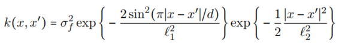

```{r setup, include=FALSE}
knitr::opts_chunk$set(echo = TRUE)
library(magrittr)
library(kernlab)
library(AtmRay)
```


# Q1

## 1.1

```{r q1-pic1, out.width='50%'}
knitr::include_graphics("gpr.png")
```

* A/b means the vector x that solves the equation Ax = b

**Completingn the code of posteriorGP and kernel function**

```{r q1-p1}
posteriorGP = function(X, y, XStar, sigmaNoise,k,...){ # step 1
  # Arguments
  #   X: Vector of training inputs.
  #   y: Vector of training targets/outputs.
  #   XStar: Vector of inputs where the posterior distribution is evaluated, i.e. X∗.
  #   sigmaNoise: Noise standard deviation σn.
  #   k: Covariance function or kernel, a separate function to call in the function
  
  # Returns
  #   a vector with (1) the posterior mean and (2) the posterior variance of f
  
  #the code begins-------------------->
  #   Note that L in the algorithm is a lower triangular matrix, ***************************
  #   whereas the R function returns an upper triangular matrix. ***************************
  #   So, you need to transpose the output of the R function.***************************
    L = chol( k(X,X,...) + sigmaNoise^2*diag(length(y))   )%>%t()   # step 2
    alpha = solve(t(L),solve(L,y))                    # step 3
    E_f_star = t(k(X, XStar, ...)) %*% alpha         # step 4
    v = solve(L,  k(X, XStar, ...)  )                   # step 5
    V_f_star = k(XStar, XStar, ...) - t(v) %*% v    # step 6, variance of f_star
                              # no log likelihood here  step 7
    
    return(list(predictive_mean=E_f_star,predictive_var=V_f_star))                  #  step 8, the so-called
  
  #the code ends<---------------------
  
}

# Covariance function, copied from the demonstration code
SquaredExpKernel <- function(x1,x2,sigmaF=1,l=runif(1)){
  # Computes the covariance matrix K(x1,x2), using squared exponential kernel.
  # 
  # Arguments:
  #   x1, x2: Points to compute the kernel.
  #   sigmaf: Standard deviation.
  #   l: Length scale, related to smoothing effect   
  # 
  # Returns:
  #   The covariance matrix K(x1,x2), using squared exponential kernel.
    n1 <- length(x1)
    n2 <- length(x2)
    K <- matrix(NA,n1,n2)
    for (i in 1:n2){
      K[,i] <- sigmaF^2*exp(-0.5*( (x1-x2[i])/l)^2 )
    }
    return(K)
}

```


## 1.2

try a point c(0.4,0.719) 

```{r q1-p1.2}

# the needed parameters and inputs

sigmaF=1
l=0.3   
#-------------------------------------
X=0.4
y=0.719   # training data
#XStar = seq(from = -1, to = 1 ,by = 0.01)-> xGrid
sigmaNoise=0.1  
k=SquaredExpKernel

```


```{r q1-p1.2-plot}
# modified by the sample code
plot_res = function(X, y, sigmaF, l){
  xGrid = seq(-1, 1, 0.01)->XStar
  gp_res = posteriorGP(X, y, XStar,sigmaNoise, k, sigmaF, l)
  plot(xGrid, gp_res$predictive_mean, type = "l", main = "Posterior Mean,i.e.,predicted mean", xlab = "x", ylab = "f", ylim = c(-3,3))
  points(X, y, col="black", pch=19)
  lines(xGrid, gp_res$predictive_mean - 1.96*sqrt(diag(gp_res$predictive_var)), col = "red")
  lines(xGrid, gp_res$predictive_mean + 1.96*sqrt(diag(gp_res$predictive_var)), col = "red")
  legend("bottomright", legend=c("predictive_mean","training points","+1.96 SD",  "-1.96 SD")
         , pch=c(1,1,1,1), lty=c(1,1,1,1),lwd=c(1,1,1, 1), col=c("black","black","red","red"))
}

plot_res(X, y, sigmaF, l)
```

## 1.3

when the inputs/training data are

```{r q1-p1.3}

X=c(0.4, -0.6)
y=c(0.719, -0.044)   # training data

plot_res(X, y, sigmaF, l)
```


## 1.4
when the inputs are...
```{r q1-p1.4}

X = c(-1.0, -0.6, -0.2, 0.4, 0.8)
y = c(0.768, -0.044, -0.940, 0.719, -0.664)  # training data

plot_res(X, y, sigmaF, l)
```
## 1.5


change l to be 1
```{r q1.5}
#sigmaF=1
l=1   #　the kernel parameters
#-------------------------------------
X = c(-1.0, -0.6, -0.2, 0.4, 0.8)
y = c(0.768, -0.044, -0.940, 0.719, -0.664)  # training data

plot_res(X, y, sigmaF, l)
```


# Q2


```{r q2-0-p1}

TempTullinge = read.csv("https://github.com/STIMALiU/AdvMLCourse/raw/master/GaussianProcess/Code/TempTullinge.csv", header=TRUE, sep=";")

TempTullinge$time = 1:nrow(TempTullinge)   # row.names(TempTullinge)%>%as.numeric()
TempTullinge$day = rep(1:365,6) # nrow(TempTullinge)/365

sample_index<-seq(from = 1, to = nrow(TempTullinge), by = 5)


TempTullinge1<-TempTullinge[sample_index,]

# normalized the data from y to x
TempTullinge1[,2:4]<- scale(TempTullinge1[,2:4]  )#%>%var() #summary


```


## 2.1


```{r q2-1-p1}
x1=1
x2=2

X <- c(1,3,4) 
Xstar <- c(2,3,4)->y

# create a wheel, the new clothes of the king essentially
The_SquaredExpKernel <- function(sigmaF=1,l=3){
   
  rval <- function(x1,x2){ # SquaredExpKernel
    n1 <- length(x1)
    n2 <- length(x2)
    K <- matrix(NA,n1,n2)
    for (i in 1:n2){K[,i] <- sigmaF^2*exp(-0.5*( (x1-x2[i])/l)^2 )    }
    
    return(K)      }
  
  class(rval)='kernel'
  return(rval)
}


k = The_SquaredExpKernel()
k(x1,x2)

K = kernelMatrix(kernel = k, x = X, y = y)

K
```


## 2.2
```{r q2-2-p1}
# from the question, the y,namely,temp should be scaled, for convenience, so is to other numeric variables
lm_res=lm(temp ~ time + I(time^2),data=TempTullinge1)
lm_res

sigmaNoise2=lm_res$residuals%>%var()

gp_fit<-gausspr(x=TempTullinge1$time,y=TempTullinge1$temp,
                kernel = The_SquaredExpKernel(sigmaF = 20, l = 0.2),
                var = sigmaNoise2 )


temp_hat = predict(gp_fit, TempTullinge1$time)

#----------------------------------------------

plot(TempTullinge1$time, TempTullinge1$temp, type="p", xlab = "time", ylab = "temp")
lines(TempTullinge1$time, temp_hat, col = "red", lwd = 1)
legend("bottomright", legend=c("acutal temp","predicted temp")
         , pch=c(1,1), lty=c(1,1),lwd=c(1,1), col=c("black","red"))


```


## 2.3

```{r q2-3-p1}

sigmaF=20
l=0.2   
#-------------------------------------
X = TempTullinge1$time
y = TempTullinge1$temp-> XStar # training data
XStar = X-> xGrid
sigmaNoise=sigmaNoise2%>%sqrt() 
k=SquaredExpKernel


res_gp<-posteriorGP(X, y, XStar,sigmaNoise, k, sigmaF, l)
predictive_var = res_gp$predictive_var%>%diag()

#---------------
plot(x = X, y = y)
lines(X, temp_hat, col="red")
lines(X, temp_hat + 1.96*sqrt(predictive_var), col="blue", lwd=2)
lines(X, temp_hat - 1.96*sqrt(predictive_var), col="blue", lwd=2)
legend("bottomright", legend=c("acutal temp","predicted temp","+1.96 SD predicted temp","-1.96 SD predicted temp ")
         , pch=c(1,1,1,1), lty=c(1,1,1,1),lwd=c(1,2,1,1), col=c("black","red","blue","blue"))

```


## 2.4


```{r q2-4-p1}
#sigmaF=20
#l=0.2
#k=The_SquaredExpKernel(sigmaF,l)
gp_fit_day<-gausspr(x=TempTullinge1$day,y=TempTullinge1$temp,
                kernel = The_SquaredExpKernel(sigmaF = 20, l = 0.2),
                var = sigmaNoise2 )


temp_hat_day = predict(gp_fit_day, TempTullinge1$day)


plot(TempTullinge1$time, TempTullinge1$temp, type="p", main="Time vs temperature")
lines(TempTullinge1$time, temp_hat, type="l", lwd=2, xlab="Time", ylab="Temp", col="red")
lines(TempTullinge1$time, temp_hat_day, type="l", lwd=2, col="blue")
legend("bottomright", legend=c("Data", "Predicted by time", "Predicted by day"), pch=c(1, NA, NA), lty=c(NA, 1, 1),
       lwd=c(NA, 2, 2), col=c("black", "red", "blue"))


```


## 2.5

no discussion yet

```{r q2-pic1, out.width='50%'}

```
```{r q2-5-p1}
# write the formula above,be careful, try to be no typo!!!!!
PeriodicKernel <- function(sigmaF=1,l1=1, l2=10, d){   # pk for short
  k = function(x, xStar) {
    diff = abs(x-xStar)
    return(sigmaF^2*exp(-((2*sin(pi*diff))/d)/l1^2)*exp(-0.5*diff^2/l2^2))
  }
  class(k)='kernel'
  return(k)
}

```

```{r q2-5-p2}

gp_fit_pk<-gausspr(x=TempTullinge1$time,y=TempTullinge1$temp,
                kernel = PeriodicKernel(sigmaF = 20, l1 = 1, l2 = 10, d=365/sd(TempTullinge1$time)  ),
                var = sigmaNoise2 )


temp_hat_pk = predict(gp_fit_pk, TempTullinge1$time)

#--------------------------------------------------------------------------------------------------------------------------
plot(TempTullinge1$time, TempTullinge1$temp, type="p", main="Time vs temperature")
lines(TempTullinge1$time, temp_hat, type="l", lwd=2, xlab="Time", ylab="Temp", col="red")
lines(TempTullinge1$time, temp_hat_day, type="l", lwd=2, col="blue")
lines(TempTullinge1$time, temp_hat_pk, type="l", lwd=2, col="green")
legend("bottomright", legend=c("Data", "Predicted by time", "Predicted by day","Predicted by PK")
       , pch=c(1,1,1,1), lty=c(1,1,1,1),lwd=c(2,2,2,2)
       , col=c("black", "red", "blue","green"))

```


# Q3


```{r q3.0}
# data prepare
data <- read.csv("https://github.com/STIMALiU/AdvMLCourse/raw/master/GaussianProcess/Code/banknoteFraud.csv", header=FALSE, sep=",")
names(data) <- c("varWave","skewWave","kurtWave","entropyWave","fraud")
data[,5] <- as.factor(data[,5])
set.seed(111)
SelectTraining <- sample(1:dim(data)[1], size = 1000, replace = FALSE)
train=data[SelectTraining,]
test=data[-SelectTraining,]

```


## 3.1

```{r q3.1-p1}
model1 = gausspr(fraud ~ varWave+skewWave, data=train)
fraud_hat1 = predict(model1, newdata=train)

confusion_mx=table(predict=fraud_hat1, label=train[,5])

sum(diag(confusion_mx))/sum(confusion_mx)

```
```{r q3.1-p2 }
# class probabilities respectively
probPreds <- predict(model1, train, type="probabilities")
x1 <- seq(min(train$varWave),max(train$varWave),length=100)
x2 <- seq(min(train$skewWave),max(train$skewWave),length=100)
gridPoints <- meshgrid(x1, x2)
gridPoints <- cbind(c(gridPoints$x), c(gridPoints$y))

gridPoints <- data.frame(gridPoints)
names(gridPoints) <- names(subset(train, select=c("varWave", "skewWave")))
probPreds <- predict(model1, gridPoints, type="probabilities")

# Plotting for Prob(Fraud)
contour(x1,x2,matrix(probPreds[,1],100,byrow = TRUE), 20, xlab = "varWave", ylab = "skewWave", main = 'Prob(Fraud) - Fraud is red')
points(train[train[,5]==1,1],train[train[,5]==1,2],col="red")
points(train[train[,5]==0,1],train[train[,5]==0,2],col="blue")


```


## 3.2

```{r q3.2-p1}
test_fraud_hat = predict(model1, newdata=test)
confusion_mx=table(predict=test_fraud_hat, label=test[,5])

sum(diag(confusion_mx))/sum(confusion_mx)

```

## 3.3

```{r q3.3-p1}

model = gausspr(fraud ~., data=train)
fraud_hat = predict(model, newdata=test)

confusion_mx=table(predict=fraud_hat, label=test[,5])

sum(diag(confusion_mx))/sum(confusion_mx)

```


# Appendix

```{r ref.label=knitr::all_labels(),echo=TRUE,eval=FALSE}


```
